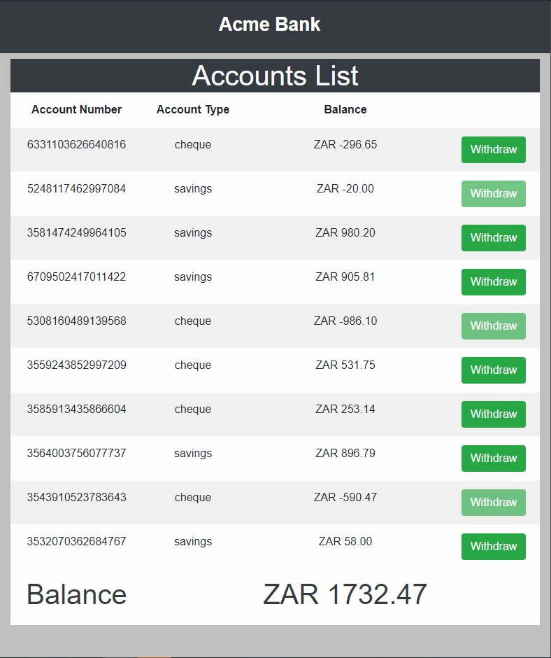

# Interview Assessment Accounts Demo

The business rules are as follow

## You are writing a small part of a banking system for Acme Bank:
* Acme bank runs only 2 types of accounts, a Savings and Current account.
* Most of the behaviour in these 2 types of accounts is very similar
* For the purpose of this exercise, we will not look at all the functionality, we will only implement the
“withdraw” and “balance”.

### Savings Account:
* A savings account must have a minimum balance of greater than 0 to perform a withdraw
### Current Account:
* A current account can have an overdraft limit (the maximum overdraft limit allowed on a current
account by Acme bank is R500.00
* This means that a current account can have both positive and negative for withdraw.

## Current interface
